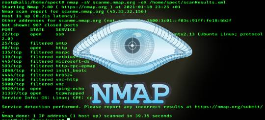
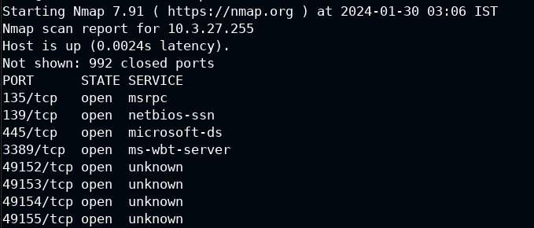
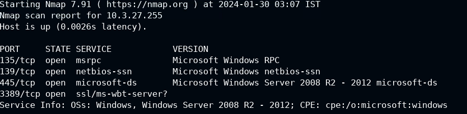
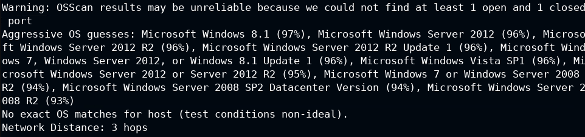
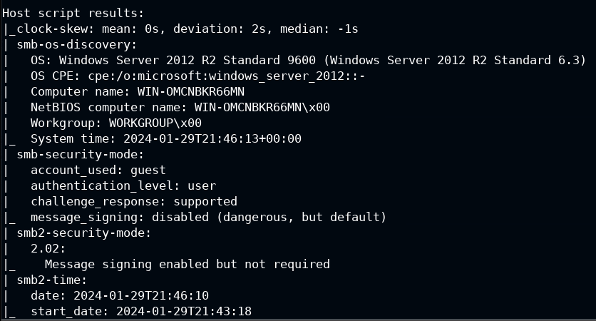
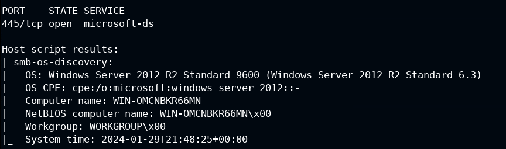
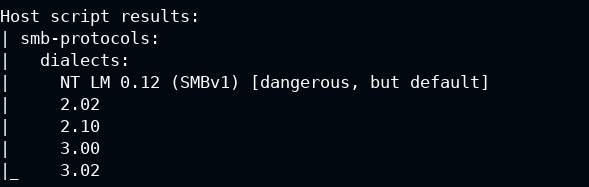
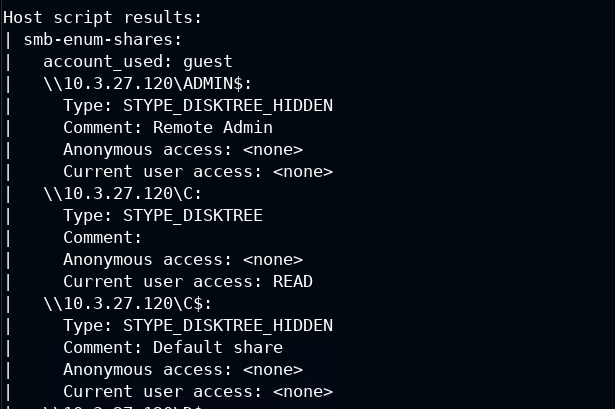

# Nmap
Let's introduce nmap to perform active information gathering

# Introduction of the tool
## NMAP
Nmap is a tool that can scan IP addresses and ports in a network and detect installed applications. It is used for network mapping, security auditing, and vulnerability scanning. Nmap can also find information about the operating system and services running on a device. Nmap is open-source and works on Linux, Windows, and macOS.  
 

Nmap 7.94SVN ( https://nmap.org ) 
Usage: nmap [Scan Type(s)] [Options] {target specification} 
### **TARGET SPECIFICATION:**
  Can pass hostnames, IP addresses, networks, etc.  
  Ex: scanme.nmap.org, microsoft.com/24, 192.168.0.1; 10.0.0-255.1-254  
  - -iL <inputfilename>: **Input from list of hosts/networks**
  - -iR <num hosts>: **Choose random targets**
  - --exclude <host1[,host2][,host3],...>: **Exclude hosts/networks**
  - --excludefile <exclude_file>: **Exclude list from file **
### **HOST DISCOVERY:**
  - -sL: **List Scan - simply list targets to scan**
  - -sn: **Ping Scan - disable port scan**
  - -Pn: **Treat all hosts as online -- skip host discovery**
  - -PS/PA/PU/PY[portlist]: **TCP SYN/ACK, UDP or SCTP discovery to given ports**
  - -PE/PP/PM: **ICMP echo, timestamp, and netmask request discovery probes**
  - -PO[protocol list]: **IP Protocol Ping**
  - -n/-R: **Never do DNS resolution/Always resolve [default: sometimes]**
  - --dns-servers <serv1[,serv2],...>: **Specify custom DNS servers**
  - --system-dns: **Use OS's DNS resolver**
  - --traceroute: **Trace hop path to each host **
### **SCAN TECHNIQUES:**
  - -sS/sT/sA/sW/sM: **TCP SYN/Connect()/ACK/Window/Maimon scans**
  - -sU: **UDP Scan**
  - -sN/sF/sX: **TCP Null, FIN, and Xmas scans**
  - --scanflags <flags>: **Customize TCP scan flags**
  - -sI <zombie host[:probeport]>: **Idle scan**
  - -sY/sZ: **SCTP INIT/COOKIE-ECHO scans**
  - -sO: **IP protocol scan**
  - -b <FTP relay host>: **FTP bounce scan **
### **PORT SPECIFICATION AND SCAN ORDER:**
  - -p <port ranges>: **Only scan specified ports**
    Ex: -p22; -p1-65535; -p U:53,111,137,T:21-25,80,139,8080,S:9
  - --exclude-ports <port ranges>: **Exclude the specified ports from scanning**
  - -F: **Fast mode - Scan fewer ports than the default scan**
  - -r: **Scan ports sequentially - don't randomize**
  - --top-ports <number>: **Scan <number> most common ports**
  - --port-ratio <ratio>: **Scan ports more common than <ratio> **
### **SERVICE/VERSION DETECTION:**
  - -sV: **Probe open ports to determine service/version info**
  - --version-intensity <level>: **Set from 0 (light) to 9 (try all probes)**
  - --version-light: **Limit to most likely probes (intensity 2)**
  - --version-all: **Try every single probe (intensity 9)**
  - --version-trace: **Show detailed version scan activity (for debugging) **
### **SCRIPT SCAN:**
  - -sC: **equivalent to --script=default**
  - --script=<Lua scripts>:**<Lua scripts> is a comma separated list of
           directories, script-files or script-categories**
  - --script-args=<n1=v1,[n2=v2,...]>: **provide arguments to scripts**
  - --script-args-file=filename: **provide NSE script args in a file**
  - --script-trace: **Show all data sent and received**
  - --script-updatedb: **Update the script database.**
  - --script-help=<Lua scripts>: **Show help about scripts.
           <Lua scripts> is a comma-separated list of script-files or
           script-categories. **
### **OS DETECTION:**
  - -O: **Enable OS detection**
  - --osscan-limit: **Limit OS detection to promising targets**
  - --osscan-guess: **Guess OS more aggressively **
### **TIMING AND PERFORMANCE:**
  Options which take <time> are in seconds, or append 'ms' (milliseconds),
  's' (seconds), 'm' (minutes), or 'h' (hours) to the value (e.g. 30m).
  - -T<0-5>: **Set timing template (higher is faster)**
  - --min-hostgroup/max-hostgroup <size>: **Parallel host scan group sizes**
  - --min-parallelism/max-parallelism <numprobes>: **Probe parallelization**
  - --min-rtt-timeout/max-rtt-timeout/initial-rtt-timeout <time>: **Specifies
      probe round trip time.**
  - --max-retries <tries>: **Caps number of port scan probe retransmissions.**
  - --host-timeout <time>: **Give up on target after this long**
  - --scan-delay/--max-scan-delay <time>: **Adjust delay between probes**
  - --min-rate <number>: **Send packets no slower than <number> per second**
  - --max-rate <number>: **Send packets no faster than <number> per second **
### **FIREWALL/IDS EVASION AND SPOOFING:**
  - -f; --mtu <val>: **fragment packets (optionally w/given MTU)**
  - -D <decoy1,decoy2[,ME],...>: **Cloak a scan with decoys**
  - -S <IP_Address>: **Spoof source address**
  - -e <iface>: **Use specified interface**
  - -g/--source-port <portnum>: **Use given port number**
  - --proxies <url1,[url2],...>: **Relay connections through HTTP/SOCKS4 proxies**
  - --data <hex string>: **Append a custom payload to sent packets**
  - --data-string <string>: **Append a custom ASCII string to sent packets**
  - --data-length <num>: **Append random data to sent packets**
  - --ip-options <options>: **Send packets with specified ip options**
  - --ttl <val>: **Set IP time-to-live field**
  - --spoof-mac <mac address/prefix/vendor name>: **Spoof your MAC address**
  - --badsum: **Send packets with a bogus TCP/UDP/SCTP checksum **
### **OUTPUT:**
  - -oN/-oX/-oS/-oG <file>: **Output scan in normal, XML, s|<rIpt kIddi3,
     and Grepable format, respectively, to the given filename.**
  - -oA <basename>: **Output in the three major formats at once**
  - -v: **Increase verbosity level (use -vv or more for greater effect)**
  - -d: **Increase debugging level (use -dd or more for greater effect)**
  - --reason: **Display the reason a port is in a particular state**
  - --open: **Only show open (or possibly open) ports**
  - --packet-trace: **Show all packets sent and received**
  - --iflist: **Print host interfaces and routes (for debugging)**
  - --append-output: **Append to rather than clobber specified output files**
  - --resume <filename>: **Resume an aborted scan**
  - --noninteractive: **Disable runtime interactions via keyboard**
  - --stylesheet <path/URL>: **XSL stylesheet to transform XML output to HTML**
  - --webxml: **Reference stylesheet from Nmap.Org for more portable XML**
  - --no-stylesheet: **Prevent associating of XSL stylesheet w/XML output **
### **MISC:**
  - -6: **Enable IPv6 scanning**
  - -A: **Enable OS detection, version detection, script scanning, and traceroute**
  - --datadir <dirname>: **Specify custom Nmap data file location**
  - --send-eth/--send-ip: **Send using raw ethernet frames or IP packets**
  - --privileged: **Assume that the user is fully privileged**
  - --unprivileged: **Assume the user lacks raw socket privileges**
  - -V: **Print version number**
  - -h: **Print this help summary page. **

## List of usefull commands:
**Port scanning 21 (FTP), 22 (SSH), 80 (HTTP), 139 and 445 (SMB), 1433 and 3306 (MSSQL and MySQL), and 3389 (RDP).** 
 -  nmap ip **(scan port, state and service, tcp default)**
 -  nmap -sn ip **(scan type ping)**
 -  nmap -sS ip **(stealthy mode)**
 -  nmap --open ip **(only open ports)**
 -  nmap ip -p- **(scan all ports 65535)**
 -  nmap -Pn ip **(scan WINDOWS)**
 -  nmap -Pn -p 80,445 ip **(scan specific ports, 80 e 445)**
 -  nmap -Pn -p1-65535 ip **(scan a range ports)**
 -  nmap -sU ip **(UDP scan)**
 -  nmap -Pn  ip -v **(scan with verbose mode)**
 -  nmap -Pn -O ip -v **(Enable O.S. detection)**
 -  nmap -Pn -sC ip -v **(Enable script scanning)**
 -  nmap -Pn -sV ip -v **(Enables service and version detection)**
 -  nmap -Pn -O -sC -sS -sV -v ip -p22,21… (**Complete scan to specific port on Windows)**
 -  nmap -O -sC -sV -sS -v ip -p21,22…**(Complete scan to specific port on Linux)**

## My personal list of scripts:
## Windows SMB 445
  -  nmap --script smb-os-discovery.nse -p 445 192.126.66.3 **(trova il nome del computer, il nome del dominio, il nome del workgroup, la versione del sistema operativo, il tipo di server e altre informazioni utili)**
  -  nmap -p445 --script smb-protocols 192.144.106.3 **(trova la versione dei protocolli che supporta SMB)**
  -  nmap -p445 --script smb-enum-shares 10.0.17.200 **(enumera le shares, se trovi IPC con read e write, permette ad utenti anonymous di fare determinate azioni)**
  -  nmap --script smb-enum-users.nse -p445 192.144.106.3 **(lista tutti gli user esistenti sul server samba)**
  -  nmap -p445 --script smb-security-mode 10.0.17.200 **(mostra delle informazioni sulla security level)**
  -  nmap -p445 --script smb-enum-sessions 10.0.17.200 **(Enumerating the users logged into a system through an SMB share, potresti trovare misconfig, accesso senza password)**
  -  nmap -p445 --script smb-enum-sessions --script-args smbusername=administrator,smbpassword=smbserver_771 10.0.17.200 **(ritrovi la stessa cosa di sopra)**
  -  nmap -p445 --script smb-enum-shares --script-args smbusername=administrator,smbpassword=smbserver_771 10.0.17.200 **(stessa scan di sopra con credenziali per vedere tutti i permessi, a volte puoi scrivere e leggere su ogni drive)**
  -  nmap -p445 --script smb-enum-users --script-args smbusername=administrator,smbpassword=smbserver_771 10.0.17.200 **(enumera gli utenti windows)**
  -  nmap -p445 --script smb-server-stats --script-args smbusername=administrator,smbpassword=smbserver_771 10.0.17.200 **(enumera le statistiche del server)**
  -  nmap -p445 --script smb-enum-domains --script-args smbusername=administrator,smbpassword=smbserver_771 10.0.17.200 **(enumera i domini disponibili)**
  -  nmap -p445 --script smb-enum-groups --script-args smbusername=administrator,smbpassword=smbserver_771 10.0.17.200 **(enumera gli user group)**
  -  nmap -p445 --script smb-enum-services --script-args smbusername=administrator,smbpassword=smbserver_771 10.0.17.200 **(enumera i servizi)**
  -  nmap -p445 --script smb-enum-shares,smb-ls --script-args smbusername=administrator,smbpassword=smbserver_771 10.0.17.200 (**enumera tutte le cartelle shared)**

## Linux Samba 445 
  -  nmap --script smb-os-discovery.nse -p 445 192.126.66.3 **(trova il nome del computer, il nome del dominio, il nome del workgroup, la versione del sistema operativo, il tipo di server e altre informazioni utili)**
  -  nmap -p445 --script smb-protocols 192.144.106.3 **(trova la versione dei protocolli che supporta SMB)**
  -  nmap -p445 --script smb-enum-shares 10.0.17.200 **(enumera le shares, se trovi IPC con read e write, permette ad utenti anonymous di fare determinate azioni)**
  -  nmap --script smb-enum-users.nse -p445 192.144.106.3 **(lista tutti gli user esistenti sul server samba)**
  -  nmap -p445 --script smb-security-mode 10.0.17.200 **(mostra delle informazioni sulla security level)**
  -  nmap -p445 --script smb-enum-sessions 10.0.17.200 **(Enumerating the users logged into a system through an SMB share, potresti trovare misconfig, accesso senza password)**
  -  nmap -p445 --script smb-enum-sessions --script-args smbusername=administrator,smbpassword=smbserver_771 10.0.17.200 **(ritrovi la stessa cosa di sopra)**
  -  nmap -p445 --script smb-enum-shares --script-args smbusername=administrator,smbpassword=smbserver_771 10.0.17.200 **(stessa scan di sopra con credenziali per vedere tutti i permessi, a volte puoi scrivere e leggere su ogni drive)**
  -  nmap -p445 --script smb-enum-users --script-args smbusername=administrator,smbpassword=smbserver_771 10.0.17.200 **(enumera gli utenti windows)**
  -  nmap -p445 --script smb-server-stats --script-args smbusername=administrator,smbpassword=smbserver_771 10.0.17.200 **(enumera le statistiche del server)**
  -  nmap -p445 --script smb-enum-domains --script-args smbusername=administrator,smbpassword=smbserver_771 10.0.17.200 **(enumera i domini disponibili)**
  -  nmap -p445 --script smb-enum-groups --script-args smbusername=administrator,smbpassword=smbserver_771 10.0.17.200 **(enumera gli user group)**
  -  nmap -p445 --script smb-enum-services --script-args smbusername=administrator,smbpassword=smbserver_771 10.0.17.200 **(enumera i servizi)**
  -  nmap -p445 --script smb-enum-shares,smb-ls --script-args smbusername=administrator,smbpassword=smbserver_771 10.0.17.200 **(enumera tutte le cartelle shared)**

## Windows-Linux SMTP 25
  - nmap -sV -script banner 192.80.153.3  **(server name smtp e il banner)**

## Linux FTP 21
  -  nmap --script ftp-anon 192.159.18.3 **(check del login in anonimo)**
  -  nmap --script ftp-brute --script-args userdb=/root/users -p 21 192.235.127.3 **(brute force)**

## Linux SSH OpenSSH 22
  -  nmap --script ssh2-enum-algos 192.201.39.3 **(enumera gli algoritmi di encryption)**
  -  nmap --script ssh-hostkey --script-args ssh_hostkey=full 192.201.39.3 **(SSH ottiene le chiavi pubbliche ssh-rsa host key utilizzate dal server SSH, anche se sono uguale con il comando full)**
  -  nmap -p 22 --script ssh-auth-methods --script-args="ssh.user=student" 192.201.39.3  **(enumera i metodi di autenticazione per l'utente student)**
  -  nmap -p 22 --script=ssh-run --script-args="ssh-run.cmd=cat /home/student/FLAG **(SSH esegue il comando cat sul path)**
  -  nmap -p 22 --script ssh-brute --script-args userdb=/root/users 192.40.231.3 **(brute force sull'utente administrator per SSH con script)**

## HTTP 80
  -  nmap --script http-enum -sV -p 80 10.0.28.146 **(enumera le cartelle piu importanti)**
  -  nmap --script http-headers -sV -p 80 10.0.28.146 **(header information del server IIS, le stesse ottenute con whatweb)**
  -  nmap --script http-methods --script-args http-methods.url-path=/webdav/ ip **(vede i metodi http usabili sulla directory webdav)**
  -  nmap --script http-webdav-scan --script-args http-methods.url-path=/webdav/ ip **(scansiona web dav, vede le options allowed e pubbliche, etc)**
  -  nmap --script http-shellshock --script-args “http-shellshock.uri=/gettime.cgi” 192.242.220.3 **(vede se è vulnerabile a shell shock)**

## Script MYSQL 3306
  -  nmap --script=mysql-empty-password -p 3306 192.71.145.3 **(vede se è permesso l'accesso anonimo e ti dice quale utente lo ha)**
  -  nmap --script=mysql-info -p 3306 192.71.145.3 **(vede se supporta la capability InteractiveClient)**
  -  nmap --script=mysql-users --script-args="mysqluser='root',mysqlpass=''" -p 3306 ip **(enumera gli utenti presenti su MySQL)**
  -  nmap --script=mysql-databases --script-args="mysqluser='root',mysqlpass=''" -p 3306 192.71.145.3 **(enumera tutti i db presenti)**
  -  nmap --script=mysql-variables --script-args="mysqluser='root',mysqlpass=''" -p 3306 192.71.145.3 **(enumera le variabili)**
  -  nmap --script=mysql-audit --script-args "mysql-audit.username='root',mysql-audit.password='',mysql audit.filename='/usr/share/nmap/n selib/data/mysql-cis.audit'" -p 3306 192.71.145.3 **(check privileges.  verifica la conformità del database MySQL alle raccomandazioni del Center for Internet Security (CIS).)**
  -  nmap --script mysql-dump-hashes --script-args="username='root',password=''" -p 3306 192.71.145.3 **(mostra tutti gli utenti e i loro hash)**
  -  nmap --script=mysql-query --script-args="query='select count(*) from books.authors;',username='root',password=''" -p 3306 192.71.145.3 **(trova il numero di record che ci sono nella tabella authors del database books)**

## Script MS-SQL 1433
  -  nmap --script ms-sql-info -p 1433 10.0.30.33 **(info come il sistema operativo)**
  -  nmap -p 1433 --script ms-sql-ntlm-info --script-args mssql.instance-port=1433 10.0.30.33 **(piu info, come NetBIOS, DNS, and OS build version)**
  -  nmap -p 1433 --script ms-sql-brute --script-args userdb=/root/Desktop/wordlist/common_users.txt,passdb=/root/Desktop/wordlist/100-common-p asswords.txt 10.0.30.33 **(brute force per identificare le credenziali)**
  -  nmap -p 1433 --script ms-sql-empty-password 10.0.30.33 **(vede se qualche utente non ha pwd)**
  -  nmap -p 1433 --script ms-sql-query --script-args mssql.username=admin,mssql.password=anamaria,ms-sql-query.query="SELECT * FROM master..syslogins" 10.0.30.33 -oN output.txt **(salva il tutto su output.txt)**
  -  nmap -p 1433 --script ms-sql-dump-hashes --script-args mssql.username=admin,mssql.password=anamaria 10.0.30.33 **(dump degli hash degli utenti)**
  -  nmap -p 1433 --script ms-sql-xp-cmdshell --script-args mssql.username=admin,mssql.password=anamaria,ms-sql-xp-cmdshell.cmd="ipconfig" 10.0.30.33 **(esegui il comando shell ip config)**
  -  nmap -p 1433 --script ms-sql-xp-cmdshell --script-args mssql.username=admin,mssql.password=anamaria,ms-sql-xp-cmdshell.cmd="type c:\flag.txt" 10.0.30.33  **(legge il flag)**

## Example of enumeration with NMAP of SMB  
**Command: nmap 10.3.27.255 **
  
**Command: map -sV -p135,139,445,3389 10.3.27.255 (scan the port 135,139,445,3389 with service and version detection enabled) **
  
**Command: nmap -O -p135,139,445,3389 10.3.27.255 (OS detection enabled) **
  
**Command: nmap -sC -p135,139,445,3389 10.3.27.255 (script scanning enabled) **
   
## Running some script for SMB: 
**nmap --script smb-os-discovery.nse -p 445 10.3.27.255 **
  
**nmap -p445 --script smb-protocols  10.3.27.255 **
  
**nmap -p445 --script smb-enum-shares 10.3.27.255 **
  

#Author
<b>Xiao Li Savio Feng</b>
